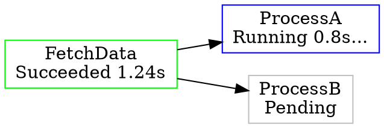

## Why

go-workflow has no built-in observability. When a workflow is running inside a production binary
it is a black box: operators cannot see which steps are running, how long they have been running,
how many retries have occurred, or where failures happened. Debugging requires either reading logs
(unstructured) or adding custom `BeforeStep`/`AfterStep` callbacks everywhere.

The goal is to make a running go-workflow process a first-class citizen in standard observability
stacks — without writing any custom frontend and without adding heavy dependencies to the root
module.

This change depends on the `structured-event-sink` change landing first, since the adapters
are implemented as `EventSink` consumers.

## What Changes

Three observability adapters, each as an independent submodule under `contrib/`:

1. **`contrib/otel`** — OpenTelemetry traces, enabling Gantt-chart visualization in Jaeger,
   Grafana Tempo, or any OTLP-compatible backend.
2. **`contrib/prometheus`** — Prometheus metrics, enabling time-series dashboards in Grafana.
3. **`contrib/dot`** — A live Graphviz DOT HTTP endpoint for lightweight development-time
   visualization, zero external dependencies.

## Capabilities

---

### `contrib/otel` — Trace-based visualization

Each workflow execution becomes an OTel trace. Each step becomes a child span. This maps
naturally onto Jaeger / Grafana Tempo's Gantt-chart UI, which shows parallel steps side by
side and serial steps in sequence — exactly the shape of a DAG execution.

**Span structure — flat workflow:**

```
workflow.Do()               ← root span  (name = workflow type or user-supplied name)
  ├── FetchData             ← child span (name = flow.String(step))
  ├── ProcessA              ← child span, starts after FetchData span ends
  └── ProcessB              ← child span, parallel with ProcessA
        └── retry attempt 2 ← span event on ProcessB span (not a child span)
```

**Span structure — nested workflow (Workflow-as-a-Step):**

Since go-workflow supports using a `Workflow` as a `Step` inside another `Workflow`, the
`EventSink` must handle the nesting correctly. The key insight is that OTel span context
propagates through `context.Context`: the inner workflow's `Do(ctx)` receives a `ctx` that
already carries the outer step's span as the active span.

The adapter should therefore **never unconditionally create a root span**. Instead:

```
outer.Do(ctx)                       ← root span (ctx has no parent span)
  ├── FetchData                     ← child span of root
  └── InnerWorkflow                 ← child span of root  (this is the step span)
        ├── SubStepA                ← child span of InnerWorkflow span
        └── SubStepB                ← child span of InnerWorkflow span
```

This works naturally because:
1. When the outer workflow starts the `InnerWorkflow` step, it calls `BeforeStep` with a ctx
   that carries the outer root span.
2. The `EventSink` creates a span for `InnerWorkflow` as a child of whatever is active in ctx.
3. The inner workflow's `Do(ctx)` receives that span in ctx; inner step spans become its children.

The adapter must inject the step span into ctx (via `BeforeStep`) so that inner workflows
inherit it. This means the EventSink needs a companion `BeforeStep` callback, not just a
passive sink — or the `WorkflowEvent` must carry the ctx.

**Open Question**: should `WorkflowEvent` carry the `context.Context` so the EventSink can
both read the parent span and inject a new span into ctx for the step? This requires the
`Started` event to be emitted before `Do()` is called (which aligns with the current
`BeforeStep` timing) and the span to be ended on the terminal event. The structured-event-sink
design should account for this requirement.

**API sketch:**

```go
import "github.com/Azure/go-workflow/contrib/otel"

tp := /* set up your TracerProvider */
sink := workflowotel.NewEventSink(tp,
    workflowotel.WithWorkflowName("my-pipeline"),
)
w := &flow.Workflow{
    EventSink: sink.Sink,
    // The adapter also needs a BeforeStep to inject the step span into ctx:
    // w.DefaultOption = &flow.StepOption{ /* BeforeStep: sink.BeforeStep */ }
    // Exact API TBD based on how EventSink and BeforeStep compose.
}
```

**Visualization**: Jaeger UI, Grafana Tempo, or any OTLP trace viewer shows:
- Horizontal Gantt bars per step, colored by status (green = succeeded, red = failed).
- Parallel steps rendered side by side.
- Nested workflows appear as a span with its own children, fully indented under the parent step.
- Retry events visible as annotations on the step's span.
- Total workflow duration as the root span duration.

**Span attributes (standard OTel semantic conventions where applicable):**

- `workflow.step` — step name
- `workflow.step.attempt` — attempt number (1-based)
- `workflow.step.status` — terminal status string
- `error.type`, `error.message` — populated on Failed / Canceled

---

### `contrib/prometheus` — Metrics-based dashboards

Exposes Prometheus metrics that can be scraped by any Prometheus-compatible system and
visualized in Grafana.

**Metrics:**

| Metric | Type | Labels | Description |
|--------|------|--------|-------------|
| `workflow_step_duration_seconds` | Histogram | `step`, `status` | Duration of each step attempt |
| `workflow_step_total` | Counter | `step`, `status` | Total step terminations by status |
| `workflow_step_retries_total` | Counter | `step` | Total retry attempts |
| `workflow_running_steps` | Gauge | `step` | Currently running steps |

**API sketch:**

```go
import "github.com/Azure/go-workflow/contrib/prometheus"

reg := prometheus.NewRegistry()
w := &flow.Workflow{
    EventSink: workflowprom.NewEventSink(reg,
        workflowprom.WithNamespace("myapp"),
    ),
}
// expose reg via /metrics as usual
```

**Visualization in Grafana:**
- **State timeline panel**: each step as a row, colored by last known status over time.
- **Time series panel**: step duration trends, retry rate over time.
- **Stat panel**: current running step count, total failed steps.

Grafana dashboard JSON can be shipped in `contrib/prometheus/dashboards/` so users can
import it directly.

---

### `contrib/dot` — Live DAG visualization (development tool)

An HTTP handler that renders the current workflow state as a Graphviz DOT document.
Intended for development and debugging, not production monitoring.

**HTTP endpoint**: mount anywhere, e.g. `GET /debug/workflow`

**DOT output example:**


Node colors: gray = Pending, blue = Running, green = Succeeded, red = Failed,
orange = Canceled, yellow = Skipped.

**API sketch:**

```go
import "github.com/Azure/go-workflow/contrib/dot"

mux.Handle("/debug/workflow", workflowdot.Handler(w))
```

Rendering options for the caller:
- In browser: serve the DOT source and use [d3-graphviz](https://github.com/magjac/d3-graphviz)
  to render in-page (the handler can serve a small self-contained HTML page).
- In terminal: `curl localhost:8080/debug/workflow | dot -Tsvg | open -f -a Safari`.
- In VS Code: paste into the Graphviz preview extension.

**No external dependencies** beyond the root go-workflow module. `dot` format is plain text.

---

## Dependencies

| Adapter | External deps |
|---------|--------------|
| `contrib/otel` | `go.opentelemetry.io/otel` (already common in Go services) |
| `contrib/prometheus` | `github.com/prometheus/client_golang` |
| `contrib/dot` | none (stdlib only) |

All deps are in submodule `go.mod` files. Root module gains zero new dependencies.

## Prerequisite

`structured-event-sink` change must land first. All three adapters are pure `EventSink`
consumers and require no other changes to the core.

## Impact

- New `contrib/otel/`, `contrib/prometheus/`, `contrib/dot/` directories, each with `go.mod`.
- No changes to root module.
- CI: add build/test jobs for each contrib submodule.
- Optionally: a `contrib/prometheus/dashboards/workflow.json` Grafana dashboard to ship
  with the adapter.
